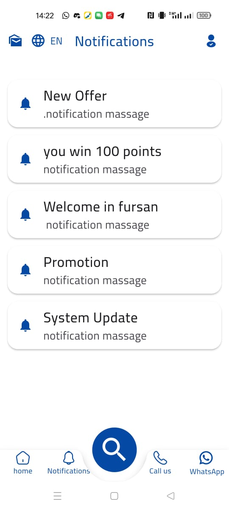
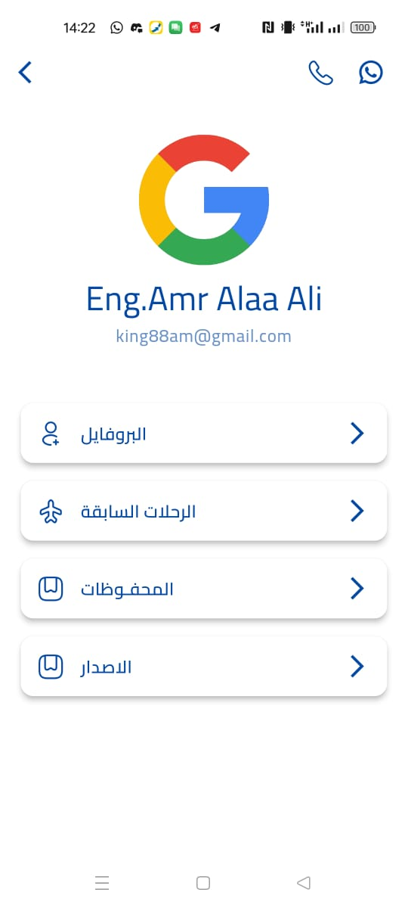
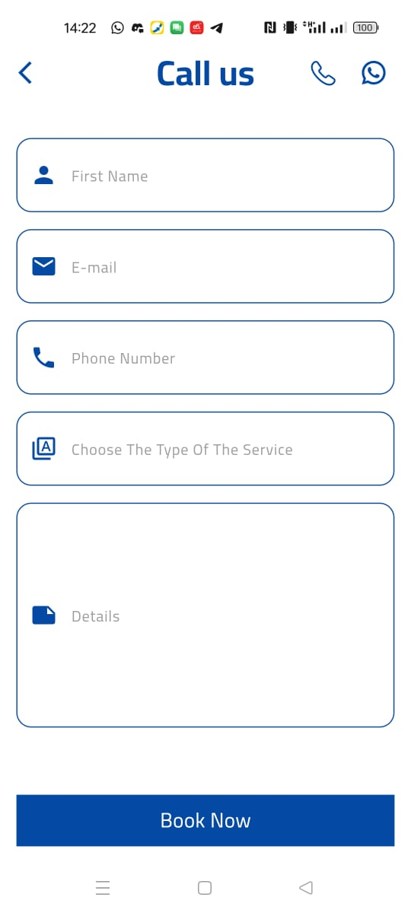
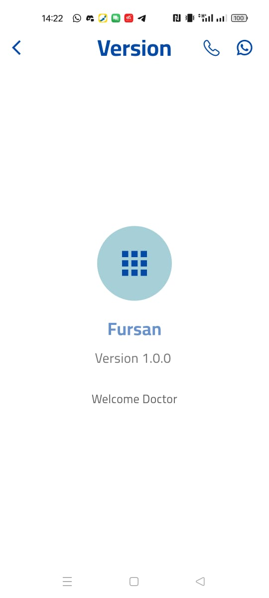

# Fursan Travel App

A user-friendly travel application designed to help you explore new destinations, find tours, get a visa, and manage your travel itineraries seamlessly. Whether you're a frequent traveler or planning your first vacation, Fursan Travel App makes it easy and enjoyable to organize your journeys.

## Table of Contents
- [Features](#features)
- [Installation](#installation)
- [Usage](#usage)
- [Technologies Used](#technologies-used)
- [Screenshots](#screenshots)
- [Video Demo](#video-demo)
- [License](#license)

## Features
- **Find Tours**: Discover and book exciting tours tailored to your interests.
- **Explore Destinations**: Access detailed guides and photos to help you plan your trip.
- **Visa Assistance**: Get help with obtaining travel visas for your destinations.
- **Explore Iraq**: Discover the rich culture and heritage of Iraq with curated experiences.
- **Notifications**: Stay informed with real-time updates and reminders.
- **Authentication**: Securely sign up, log in, and manage your account.
- **Contact Us**: Easily reach out for support or inquiries.

## Installation

1. Clone the repository:
   ```bash
   git clone https://github.com/Amr8tom/AlFursanTravel_app.git
   ```
2. Navigate to the project directory:
   ```bash
   cd fursan-travel-app
   ```
3. Install dependencies:
   ```bash
   flutter pub get
   ```
4. Run the application:
   ```bash
   flutter run
   ```

## Usage
1. Sign up or log in to access your account.
2. Find and book tours that suit your preferences.
3. Explore popular destinations and add them to your favorites.
4. Use the visa assistance feature to prepare for international travel.
5. Receive notifications about your bookings and trip updates.
6. Access curated information about exploring Iraq.
7. Contact us for any assistance or inquiries.

## Technologies Used
- **Framework**: Flutter
- **State Management**: Cubit
- **Architecture**: Clean Architecture
- **APIs**: Custom Laravel API
- **UI Design**: Clean and high-performance, utilizing the ScreenUtil package for responsiveness

## Screenshots





## Video Demo
Check out the video demo of the app: [Fursan Travel App Demo](https://www.youtube.com/watch?v=your-video-link)

## License
This project is licensed under the MIT License. See the [LICENSE](LICENSE) file for more details.

---

Happy traveling with Fursan Travel App! If you have any questions or suggestions, feel free to open an issue or reach out.

